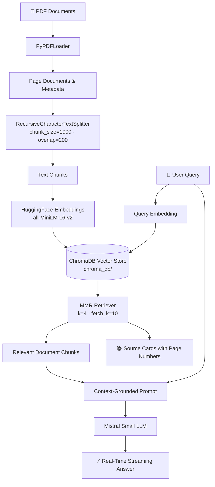

# 📚 RAG Book Assistant

> **Chat with your PDF documents using Retrieval-Augmented Generation (RAG), Hugging Face embeddings, ChromaDB, and Google Gemini.**


**RAG Book Assistant** is an AI-powered document Q&A application. Upload single or multiple PDF documents, build a local semantic vector knowledge base, and ask natural-language questions — with real-time streaming answers grounded strictly in your documents with precise source citations.

The project features a sleek, dark-themed **Streamlit Web UI** (`app.py`) alongside an interactive **Terminal CLI / Backend Engine** (`main.py`), sharing a local persistent vector database.

---

## ✨ Features

- 📄 **Multi-PDF & Append Ingestion** — Upload multiple PDFs or append new documents dynamically to your existing knowledge base.
- ⚡ **Real-Time Streaming Responses** — Interactive token-by-token answer generation with typing effect.
- 🧠 **Local Embeddings** — `sentence-transformers/all-MiniLM-L6-v2` runs offline on CPU (384-dimensional normalized vectors).
- 🗄️ **Persistent Vector Store** — ChromaDB saves your knowledge base to disk across sessions.
- 🔎 **MMR Retrieval** — Maximal Marginal Relevance for diverse, non-redundant contextual retrieval.
- 🤖 **Google Gemini Integration** — Powered by `gemini-3.6-flash` for concise, grounded answers.
- 🎯 **Strict Grounding** — Context-only prompt constraints preventing hallucinations.
- 📚 **Source Citations** — Expandable source cards linking each response to exact files and page numbers.
- 💬 **Interactive Web UI & CLI** — Run through the browser or query directly from the terminal.

---

## 🏗️ Architecture



---

## 🛠️ Tech Stack

| Layer | Technology |
|---|---|
| **Frontend UI** | Streamlit (Dark Theme, Session State, Streaming API) |
| **RAG Pipeline & Backend** | LangChain Core, Community, HuggingFace, MistralAI, Chroma |
| **Vector Database** | ChromaDB (Local persistent storage) |
| **Embedding Model** | Hugging Face `sentence-transformers/all-MiniLM-L6-v2` (Local CPU) |
| **LLM Provider** | Google Gemini (`gemini-3.6-flash`) |
| **PDF Parser** | PyPDF |
| **Environment Config** | python-dotenv |

---

## 📂 Project Structure

```text
Mini_RAG_project/
├── app.py                  # Streamlit Web App (Interactive UI with Streaming & Multi-PDF)
├── main.py                 # Core RAG engine, Ingestion pipeline, and Terminal CLI
├── Requirements.txt        # Python dependencies
├── README.md               # Project documentation
├── .env                    # Environment secrets (GOOGLE_API_KEY)
└── chroma_db/              # Persisted ChromaDB vector database
```

---

## 🚀 Quickstart Guide

### 1. Install Dependencies

```bash
pip install -r Requirements.txt
```

### 2. Configure Environment Variables

Create a `.env` file in the project root:

```ini
GOOGLE_API_KEY=your_google_api_key_here
```
*(Get your API key at [Google AI Studio](https://aistudio.google.com/apikey))*

---

## 🖥️ Usage

### Option A: Streamlit Web UI (Recommended)

Launch the interactive web application:

```bash
streamlit run app.py
```

1. Upload one or multiple PDFs in the sidebar.
2. Click **Ingest & Build Knowledge Base**.
3. Ask questions in the chat box and watch answers stream in real time.
4. Expand **Source References** to inspect matching passages and page numbers.

### Option B: Terminal CLI / Backend

- **Ingest a PDF from terminal:**
  ```bash
  python main.py --ingest path/to/document.pdf
  ```
  *(Add `--append` to keep existing documents in the database)*

- **Start interactive terminal chat:**
  ```bash
  python main.py
  ```

---

## ⚙️ Configuration & Hyperparameters

All pipeline settings are centrally configured in `main.py`:

| Parameter | Default | Description |
|---|---|---|
| `CHROMA_DB_PATH` | `"chroma_db"` | Disk directory for ChromaDB storage |
| `COLLECTION_NAME` | `"my_documents"` | ChromaDB collection identifier |
| `EMBEDDING_MODEL` | `sentence-transformers/all-MiniLM-L6-v2` | Hugging Face embedding model |
| `LLM_MODEL` | `gemini-3.6-flash` | Google Gemini model for text generation |
| `chunk_size` | `1000` | Target character length per chunk |
| `chunk_overlap` | `200` | Overlap between adjacent chunks |
| `k` (MMR) | `4` | Number of documents returned to context |
| `fetch_k` (MMR) | `10` | Candidate pool size for MMR reranking |

---


<p align="center">
  Built with ❤️ using LangChain · ChromaDB · Google Gemini · Streamlit
</p>
